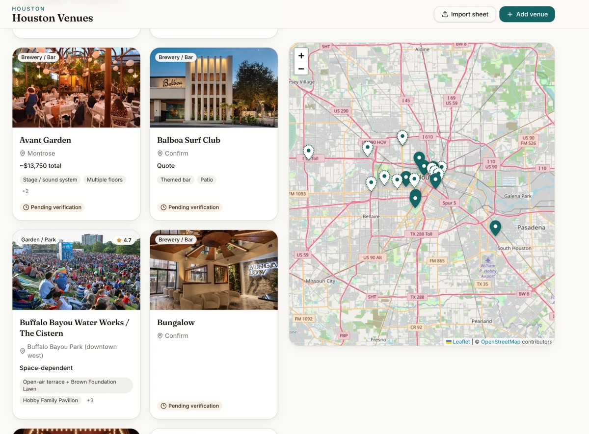

# Houston Venues

Oversikt over potensielle lokaler og leverandører til delegasjonsbesøk og arrangementer for Innovasjon Norges kontor i Houston.

**Live:** [houston-venues.vercel.app](https://houston-venues.vercel.app)



## Funksjoner

- Lokaler som kort, på kart (Leaflet og OpenStreetMap) eller begge side om side
- Filtrering på kategori og bydel, og søk på navn
- Import av lokaler fra CSV og Excel
- AI-utfylling: en Supabase Edge Function (`enrich-venue`) fyller ut manglende informasjon om et lokale
- Egen oversikt over leverandører

## Teknologi

React, TypeScript, TanStack Start, Tailwind CSS og Supabase (Postgres med Row Level Security, Edge Functions). Bygget med Lovable.

## Kjør lokalt

```bash
npm install
npm run dev
```
